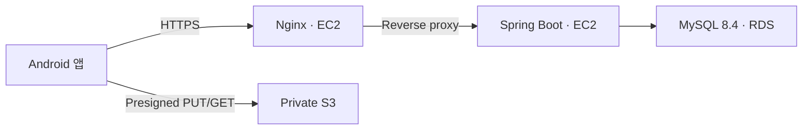

# ADR-0001: 인프라 설계

## 날짜

2026-08-07

## 컨텍스트와 문제 정의

MVP는 핵심 지도·기록 기능을 빠르게 검증해야 하며, 월 인프라 예산은 약 $50 ~ $80이다. 애플리케이션, 데이터베이스, 이미지 파일을 안전하게 분리하면서도 아직 확인되지 않은 트래픽을 위해 과도한 운영 복잡도와 비용을 만들지 않아야 한다.

## 고려한 옵션들

| 옵션 | 설명 |
| --- | --- |
| 단일 EC2에 애플리케이션·DB·파일 저장 | 가장 단순하지만 데이터와 서버 자원이 한 인스턴스에 결합된다. |
| **EC2 + RDS + S3** | 애플리케이션, DB, 이미지 파일을 각각 분리한다. |
| ALB·다중 EC2·Multi-AZ RDS·CloudFront | 가용성과 확장성을 우선하는 운영 구성이다. |

## 결정 근거

- DB를 RDS로 분리하면 EC2의 메모리 경합과 인스턴스 장애에 따른 데이터 유실 위험을 낮춘다.
- 이미지는 S3 Presigned URL로 앱이 직접 전송하면 EC2와 JVM이 파일을 중계하지 않아도 된다.
- 단일 서버 MVP에서는 ALB가 불필요하고, 개인 사진 위주의 조회에서는 초기 CloudFront 캐시 효과가 작다.
- `t4g.small`과 `db.t4g.micro` 구성은 현재 예산 범위에서 운영 가능하다.

## 결정 사항

- EC2 `t4g.small` 1대(Ubuntu 22.04 `arm64`)에서 Nginx와 Spring Boot를 실행한다.
- Nginx가 Let's Encrypt TLS 종료와 리버스 프록시를 담당한다.
- RDS MySQL 8.4 `db.t4g.micro`는 퍼블릭 접근을 막고 EC2 보안 그룹에서만 접근하도록 한다.
- S3는 퍼블릭 접근을 차단한다. 모든 객체 키에는 `mapmory/` 접두사를 붙이고 Presigned URL로만 업로드·조회한다.
- 운영 EC2는 현재 키 기반 SSH 접속을 사용한다. 접근 대상을 제한하고, 향후 SSM Session Manager
  전용 접속으로 전환할 때 SSH 인바운드 규칙을 제거한다.
- CloudWatch Agent가 `/var/log/mapmory/application.log`를
  `/mapmory/prod/application` 로그 그룹으로 전송하며, 로그 그룹 보존 기간은 7일로 설정한다.
- Prometheus EMF 로그 그룹 `/mapmory/prod/prometheus-emf`의 보존 기간은 14일이다.
- `dashboard-mapmory-prod` 대시보드와 EC2·RDS 알람을 구성하고
  `mapmory-prod-alerts` SNS 주제로 알림을 전달한다.
- AWS Budgets $40 알람은 별도로 구성한다.

### 업로드 파일 형식 정책 (2026-08-19 보완)

- 업로드 가능한 이미지 형식은 배포 환경마다 달라지는 설정값이 아니라 서버가 지원하는 기능으로 본다.
- 지원 형식과 MIME 타입, 허용 확장자, 대표 확장자의 매핑은 `UploadFileType` enum에서 단일하게 관리한다.
- `application.yaml`에는 파일 크기, 요청당 파일 개수, Presigned URL 만료 시간처럼 조정 가능한 정책값만 둔다. 지원 파일 형식 목록은 두지 않는다.
- 새로운 이미지 형식을 지원하거나 기존 형식의 지원을 중단할 때는 enum과 관련 테스트를 변경하고 배포한다.
- 환경별로 특정 형식을 활성화하거나 비활성화해야 하는 요구사항이 생기면 설정 기반 허용 목록을 다시 검토한다.

## 장단점

| 장점 | 단점 |
| --- | --- |
| 애플리케이션·DB·이미지 파일을 분리해 장애와 자원 경계를 명확히 한다. | EC2와 RDS가 단일 장애점이다. |
| 비용과 운영 복잡도를 MVP 수준으로 유지한다. | 트래픽 증가 시 즉시 수평 확장할 수 없다. |
| 파일 전송이 서버 자원을 사용하지 않는다. | S3 업로드 상태와 고아 객체를 관리해야 한다. |

CPU 크레딧 소진·OOM, 디스크 80% 초과, 조회·사진 로딩 지연, 단일 장애점 문제, 월 비용 $60 초과가 관찰되면 EC2 확장, CloudFront, ALB·다중 인스턴스 또는 Multi-AZ를 재검토한다.
