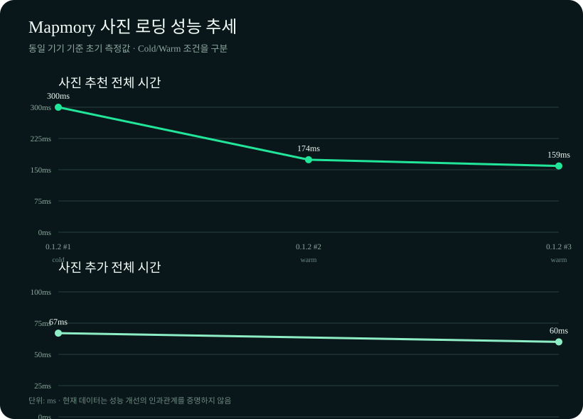

# 사진 추천 로딩 측정 결과

## 측정 목적

Room 기반 사진 메타데이터 인덱스를 연결한 뒤, 사진 추천 흐름의 단계별 소요 시간과 EXIF 좌표 재사용 여부를 확인한다.

## 추세 그래프

측정 결과는 `photo-loading-results.csv`에 누적하고, 외부 Python 패키지 없이 SVG 그래프로 생성한다.

```bash
cd /Users/chohs4164/2026-Mapmory
python3 client/docs/performance/generate_photo_loading_chart.py
```



현재 그래프는 동일 앱 버전에서 실행 횟수와 캐시 상태를 비교하는 초기 기준선이다. 앱 버전 간 개선을 판단하려면 같은 기기·같은 사진 목록·같은 캐시 조건으로 측정 결과를 추가해야 한다.

## 측정 환경

- 측정일: 2026-08-18
- 기기: Samsung SM-S938N (`R3CY103RRNL`)
- 흐름: 장소 선택 후 사진 추천 실행
- 측정 횟수: 3회
- 사진 목록: 3장
- 로그 태그: `MapmoryPhotoPerf`

## 사진 추가 흐름 측정

`사진 추가` 버튼은 장소 기반 추천과 다른 갤러리 선택 흐름이다. 이 흐름에서는 다음 로그가 출력된다.

```text
pick_total_ms=... requested_photos=... loaded_photos=...
```

Android Studio System Trace에서는 다음 구간을 확인할 수 있다.

- `photo.pick.total`: 사진 추가 전체 시간
- `photo.pick.read`: 선택한 사진 목록 처리 시간
- `photo.read.metadata`: 사진 이름·촬영일 조회
- `photo.read.exif`: EXIF 위치 조회
- `photo.read.preview`: 썸네일 로딩 및 JPEG 변환

따라서 `사진 추가` 버튼을 눌렀을 때는 `recommend_total_ms`가 아니라 `pick_total_ms`가 출력되는 것이 정상이다.

### 사진 추가 실측 예시

| 실행 | 전체 시간 | 선택 사진 | 정상 로딩 사진 |
| --- | ---: | ---: | ---: |
| 1회차 | 67ms | 3장 | 1장 |
| 2회차 | 60ms | 3장 | 1장 |

두 실행의 차이는 7ms로, 1회차 대비 약 10.4% 감소했다. 그러나 동일한 빌드에서 2회만 측정했고 정상 로딩 사진 수가 1장으로 같으므로, 유의미한 성능 개선이나 Room의 효과로 해석하지 않는다. 특히 사진을 직접 추가하는 흐름은 Room 메타데이터 인덱스를 사용하지 않는다.

## 측정 결과

| 실행 | 전체 | 장소 검색 | 메타데이터 동기화 | 이전 사진 | EXIF 조회 | 재사용 좌표 | 추천 사진 |
| --- | ---: | ---: | ---: | ---: | ---: | ---: | ---: |
| 1회차 | 300ms | 217ms | 81ms | 0 | 3회 | 0개 | 0장 |
| 2회차 | 174ms | 137ms | 37ms | 3 | 3회 | 0개 | 0장 |
| 3회차 | 159ms | 128ms | 30ms | 3 | 3회 | 0개 | 0장 |

### 1회차 대비 변화

| 항목 | 2회차 변화 | 3회차 변화 |
| --- | ---: | ---: |
| 전체 시간 | 126ms 감소, 약 42.0% 감소 | 141ms 감소, 약 47.0% 감소 |
| 메타데이터 동기화 | 44ms 감소, 약 54.3% 감소 | 51ms 감소, 약 63.0% 감소 |
| 장소 검색 | 80ms 감소, 약 36.9% 감소 | 89ms 감소, 약 41.0% 감소 |

## 해석

1. 전체 추천 시간은 300ms에서 159ms로 감소했다.
2. 메타데이터 동기화 시간도 81ms에서 30ms로 감소했다.
3. 그러나 `exif_reads=3`, `reused_coordinates=0`이 모든 실행에서 동일했다. 따라서 이번 측정만으로는 Room이 EXIF 재조회를 줄였다고 판단할 수 없다.
4. 장소 검색 시간도 217ms에서 128ms로 함께 감소했으므로, 이후 실행에서 나타난 개선에는 기기·지오코더·파일 접근 등의 워밍업 효과가 포함되었을 가능성이 있다.
5. `reverse_geocode_ms=0`, `preview_ms=0`, `recommended_photos=0`이므로 실제 추천 사진의 역지오코딩과 미리보기 로딩까지 측정된 결과는 아니다.

## 현재 결론

이번 결과는 “두 번째와 세 번째 실행이 첫 실행보다 빨라졌다”는 사실은 보여주지만, “Room 적용으로 빨라졌다”는 인과관계까지 증명하지는 못한다.

Room 캐시 효과를 확인하려면 다음 조건의 로그가 필요하다.

```text
previous_photos=3
exif_reads=0
reused_coordinates=3
```

이를 확인하려면 GPS 좌표가 포함된 사진을 사용하고, 동일한 사진 목록으로 앱 데이터를 초기화한 뒤 첫 실행과 재실행을 비교해야 한다. 또한 장소와 일치하는 사진이 있어 `recommended_photos`가 1장 이상이 되어야 미리보기 로딩 시간도 함께 측정할 수 있다.

## 측정 로그

```text
recommend_total_ms=300 target_geocode_ms=217 metadata_sync_ms=81 reverse_geocode_ms=0 preview_ms=0 previous_photos=0 media_store_photos=3 exif_reads=3 reused_coordinates=0 recommended_photos=0
recommend_total_ms=174 target_geocode_ms=137 metadata_sync_ms=37 reverse_geocode_ms=0 preview_ms=0 previous_photos=3 media_store_photos=3 exif_reads=3 reused_coordinates=0 recommended_photos=0
recommend_total_ms=159 target_geocode_ms=128 metadata_sync_ms=30 reverse_geocode_ms=0 preview_ms=0 previous_photos=3 media_store_photos=3 exif_reads=3 reused_coordinates=0 recommended_photos=0
```
