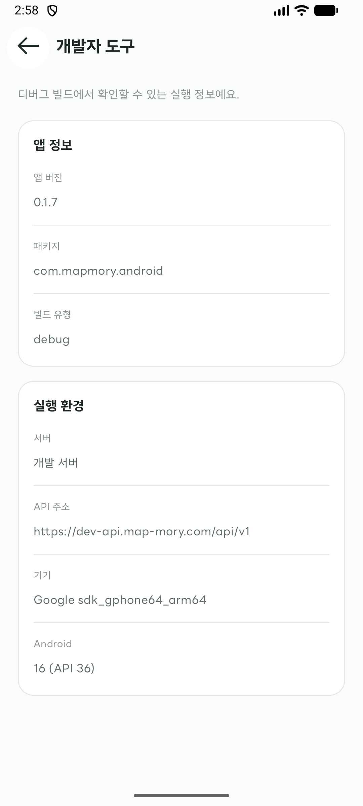

# 스프린트 2, Android 개발자 도구

## 목적

개발 중인 앱의 빌드와 서버 환경을 앱 안에서 확인하고, 운영 빌드에서는 도구에 진입할 수 없도록 한다.

## 진입 방법

디버그 빌드에서 `통계` 화면의 설정 버튼을 누른 뒤 `개발자 도구`를 선택한다. Android의 `ApplicationInfo.FLAG_DEBUGGABLE`이 켜진 경우에만 도구 정보가 앱에 전달되고 설정 메뉴 항목이 표시된다.

## 화면에서 확인하는 정보

- 앱 버전과 패키지 ID
- 빌드 유형
- API 서버 환경과 전체 API 주소
- 기기 모델
- Android 버전과 API 레벨

## 릴리스 빌드에서 진입할 수 없는 근거

릴리스 빌드는 디버그 가능 플래그가 꺼져 있으므로 `MainActivity`가 개발자 도구 정보를 만들지 않는다. 정보가 없는 경우 설정 항목이 표시되지 않으며, 개발자 도구 경로에 직접 도달하더라도 화면을 열지 않고 이전 화면으로 돌아간다.

빌드 변형별 확인 결과:

- `debug`, `ApplicationInfo.FLAG_DEBUGGABLE`이 켜져 개발자 도구 정보가 생성된다.
- `release`, 병합된 매니페스트에 `android:debuggable="true"`가 없어 개발자 도구 정보가 전달되지 않는다.
- `internal`, release 설정을 상속하므로 디버그 가능 플래그가 꺼져 있다. 개발 서버를 사용하더라도 개발자 도구 메뉴는 노출되지 않는다.

확인한 빌드 명령:

- `:androidApp:assembleDebug`
- `:androidApp:assembleRelease`
- `:androidApp:assembleInternal`
- `:androidApp:assembleDebugAndroidTest`

## 테스트

`MapmoryAppNavigationTest`의 다음 테스트로 화면 노출과 정보를 확인한다.

- `개발자_도구는_디버그_정보가_제공될_때만_설정에서_열린다`
- `개발자_도구_진입은_정보가_없으면_설정에_노출되지_않는다`

두 테스트는 `:androidApp:assembleDebugAndroidTest`로 컴파일했다. `:androidApp:connectedDebugAndroidTest` 실행은 시도했지만, Android 16 API 36.1의 Espresso가 테스트 동작 전에 `InputManager.getInstance`를 찾지 못해 이 파일의 4개 테스트 모두 실패했다. 따라서 이 실패는 개발자 도구의 검증 결과가 아니며, 계측 테스트의 런타임 검증은 미완료다.

## 화면 증거

- 디버그 빌드, 에뮬레이터에서 개발자 도구 진입 및 정보 표시 확인:

  

디버그 화면은 에뮬레이터에서 직접 진입해 캡처했다. 사용자 실기기에는 앱을 설치하지 않았다. 릴리스 화면은 실행하지 않고 병합 매니페스트에서 디버그 가능 플래그가 설정되지 않은 것을 확인했다.
